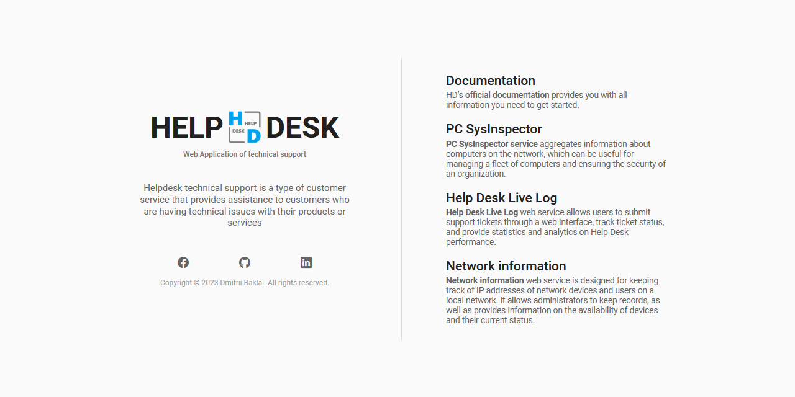
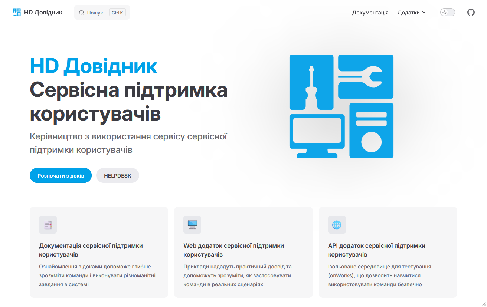
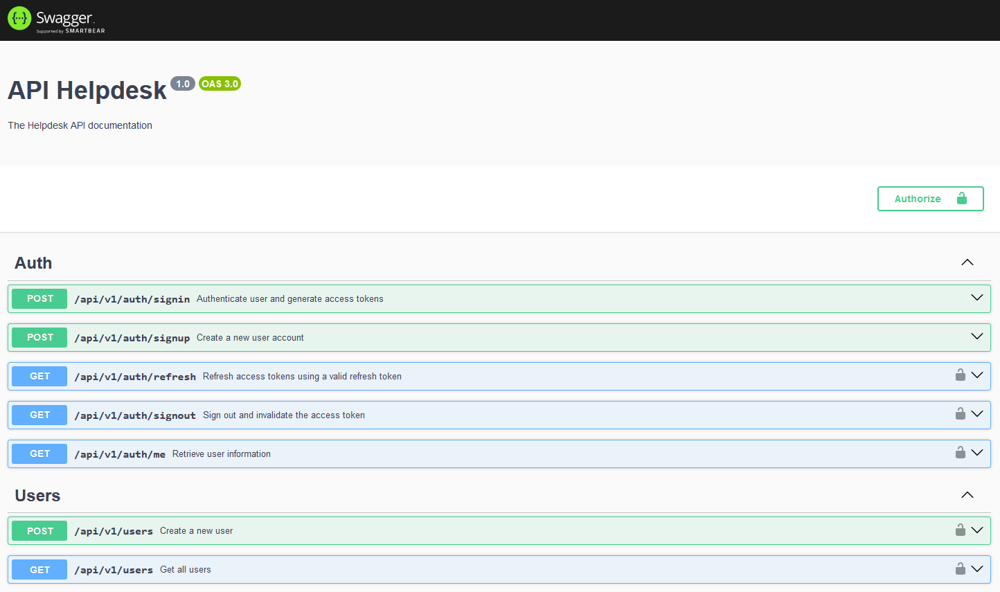

# HELPDESK («Heldesk Service»)

Веб-додаток технічної підтримки

## [Helpdesk APP](https://github.com/baklai/helpdesk-app)




## [Helpdesk Docs](https://github.com/baklai/helpdesk-docs)




## [Helpdesk API](https://github.com/baklai/helpdesk-api)




## Демо-додаток

[Веб-додаток технічної підтримки](https://helpdesk-7s9s.onrender.com)

# HELPDESK IN DOCKER

Веб-додаток технічної підтримки

## Передумови

- Docker - [Завантажте та встановіть Docker](https://docs.docker.com/engine/install/).

## Змінні проекту

| Key                      | Comment                        |
| ------------------------ | ------------------------------ |
| `MONGO_URI`              | Mongo uri                      |
| `BCRYPT_SALT`            | Crypt salt (optional)          |
| `PUBLIC_TOKEN`           | Public token (optional)        |
| `JWT_ACCESS_SECRET`      | Access token secret key        |
| `JWT_ACCESS_EXPIRES_IN`  | Access token expires in        |
| `JWT_REFRESH_SECRET`     | Refresh token secret key       |
| `JWT_REFRESH_EXPIRES_IN` | Refresh token expires in       |
| `STORAGE_PATH`           | Storage path (optional)        |
| `SMTP_HOST`              | Email service host             |
| `SMTP_PORT`              | Email service port             |
| `SMTP_USERNAME`          | Email service login            |
| `SMTP_PASSWORD`          | Email service password         |
| `SMTP_SENDER`            | Email sender                   |
| `VITE_APP_BASE_URL`      | Базова URL-адреса додатку      |
| `VITE_API_BASE_URL`      | Базова URL-адреса API додатку  |
| `VITE_DOCS_BASE_URL`     | Базова URL-адреса документації |

## Швидкий старт Docker

```bash
# Створіть спеціальний файл створення докерів `compose.yaml`
services:
  app:
    image: baklai/helpdesk:latest
    volumes:
      - ${STORAGE_PATH}:${STORAGE_PATH}
    env_file: .env
    environment:
      - NODE_ENV=production
    ports:
      - 3000:3000
    restart: unless-stopped
    container_name: helpdesk
```

### Запустіть додаток

```bash
docker compose up -d
```

### Логи додатку

```bash
docker logs --tail 30 -f helpdesk
```

### Перезапустити додаток

```bash
docker compose down && docker rmi baklai/helpdesk && docker compose up -d && docker logs -f helpdesk
```

```bash
# Видалити додаток
docker compose down
```

Після запуску програми на порту (3000 за замовчуванням) ви можете відкрити
у службу підтримки, ввівши http://localhost:3000/.

## Створюйте образи Docker

### Використовуйте реєстр Docker

```bash
docker login
```

### Створення образу Docker

```bash
docker compose build
```

### Створюйте мультиплатформенні образи докерів і надсилайте зображення до репозиторію

```bash
docker compose build --builder multibuilder --no-cache --push
```

Якщо ваша середовище використовує іншу архітектуру ЦП, ніж ваша розробка
(наприклад, ви використовуєте Mac M1, а ваш хмарний постачальник amd64),
ви захочете створити образ для цієї платформи, наприклад:

```bash
# Переконайтеся, що у вас встановлено buildx. Якщо він не встановлений, встановіть його наступним чином
docker buildx install

# Збірка та перехід на buildx builder
docker buildx create --platform linux/amd64,linux/i386,linux/arm/v5,linux/arm/v6,linux/arm/v7,linux/arm64,linux/ppc64le,linux/s390x --name multibuilder --use

# Запустіть екземпляр конструктора
docker buildx inspect --bootstrap
```
